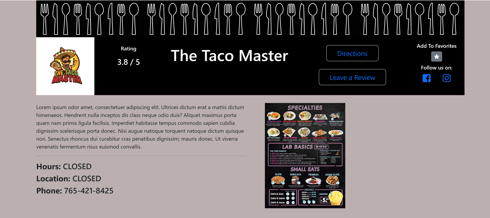
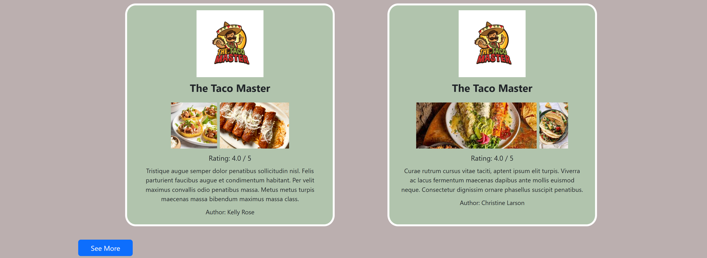

# Food Truck Locator

A full-page web application that allows users to see Quad City food trucks, view the food truck’s details, leave reviews and/or favorite food trucks, and get directions to the food truck via google maps. Built using Flask - Python - Javascript.


## Setup

### Local
Create Python virtual environment

Install requirements.txt

Set up the database:  

    ```
    (venv) $ createdb food_truck  
    ```  

    ```
    (venv) $ psql -d food_truck -f seed.sql
    ```
Start server

### Render
Click the link for Render live server app:  

[Food Truck Locator](https://foodtrucklocator.onrender.com)

## App Features:

All app features are intended to create an easy-to-use app for food truck lovers in the Quad City area. After the user-flow, see future updates planned for the Food Truck Locator App.

### Homepage:  

*   Navigation bar
    *   Click burger icon to return to homepage.
    *   Search for food trucks in the search bar and binoculars icon.
    *   Click on the profile image to access the logged-in user's profile.
*   View a static map of the Quad City area with purple pings that indicate food truck locations.  
*   View a list of registered food trucks just below the static map.  
    *   Click the logo to go the food truck's page.  
    *   Click the address for directions.
  

 
  
  

### User (Personal):

*   Header
    *   Click "Reviews" or "Favorites" (blue number) to see a list of each respectively.
    *   Click "Edit Profile" to edit signup information.
    *   Click "Change Password" to change user password.
    *   Click "Delete Account" to logout and delete your account.
*   View 3 most recently favorited food trucks. Click profile image to return to this page.
*   User can favorite or unfavorite food trucks via the toggle yellow star icon.
*   User can only edit or delete reviews created by the user.

  

  

 

### User (Business):

Note: User (Business) has all functionality of User (Personal) EXCEPT User (Business) CANNOT:
*   Favorite their own food truck.
*   Leave a Review for their food truck.  

**Please read User (Personal) first.**

*   Header
    *   Click "Edit Business Profile" to edit food truck signup information.
    *   Click "Update Location" to set food truck hours of operation and address.  
        *   To set "CLOSED"
            *   Empty "Open" and "Close" values.
            *   Set Address to "CLOSED".
*   Underneath the user's full name, "My Truck" will be listed.  
    Click the blue text food truck name to view your food truck.
        
Note: Each business user is allowed only 1 food truck per account.

  

 


### Food Truck:

*   Header
    *   View food truck average rating among Food Truck Locator users.
    *   Click "Directions" for google maps directions to the food truck.
    *   Click "Leave a Review" to leave a review for food truck.
    *   Click the toggle star to Favorite or Un-Favorite a food truck.
    *   Click the Facebook or Instagram icon to view respective food truck social media accounts.  
        **Note: Food truck owners cannot favorite or review their own food truck.**
*   View food truck:
    *   Biography
    *   Hours of Operation
    *   Location
    *   Phone Number
    *   Menu
    *   Recent 4 reviews
    *   To see all reviews: Click the See More button at the bottom of the list.

  


 

    
## APIs Used:

* MapQuest Geocoding API
* MapQuest Static Map API

## Technology Used:

*   Flask
*   Python
*   Javascript
*   Bootstrap
*   FontAwesome

## Limitations

*   The static map is not ineractive nor are the icons to show food truck details as you hover.
*   The app has not been styled for smaller screens yet.
*   The app is designed for the Quad City area only.

## Future Goals:

*   Classify trucks by category, enabling category search queries.
*   Search by currently open or rating.
*   Create a Schedule for User (Business) so the user can update location and hours of operation on a weekly basis rather than daily.